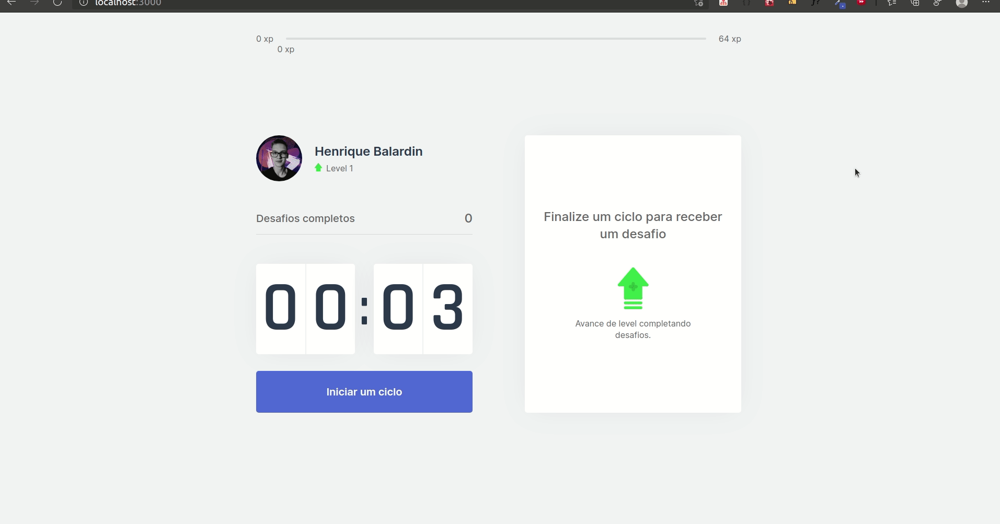

<!-- banner -->
<h1 align="center">
  
</h1
---

<!-- status -->
<p align="center"><b>Status: Finished ✅</b></p>

<!-- badges -->
<p align="center">
  
  
  <a href="https://www.linkedin.com/in/hbalardin/">
    
  </a>
  
  
</p>

---

<!-- index -->
<p align="center">
  <a href="#-about">About</a> •
  <a href="#-features">Features</a> •
  <a href="#-technologies">Technologies</a> •
  <a href="#-running-the-project">Running the project</a> •
  <a href="#-license">License</a> •
  <a href="#-readme-versions">README Versions</a>
</p>

---

## 📄 About

The purpose of **MoveIt** is to take care of the health of those who spend a large part of their day in front of the computer, through mini challenges such as stretching or a walk.

This project was developed during fourth edition of **NLW (Next Level Week)**. 

The **NLW** is a one week online event, provided by **RocketSeat**, focused on getting our hands dirty. The content is only available during the event.

---

## 🔝 Features

- Pomodoro Timer.
- Experience Levels.
- Custom Challenges.

<!-- gifs -->
<p align="center">
  
</p>

---

## 🔨 Technologies

These are the main technologies used to build the project:

- [Next](https://nextjs.org/)
- [ReactJS](https://reactjs.org/)
- [Typescript](https://www.typescriptlang.org/)

---

## 🚀 Running the project

First of all, you need to have [Git](https://git-scm.com), [Yarn](https://yarnpkg.com/) and [Node.js](https://nodejs.org/en/) installed on your machine. After that, you can proceed.

```bash
# Clone this repository:
$ git clone https://github.com/hbalardin/nlw-04-moveit

# Access the project folder:
cd nlw-04-moveit

# Install the dependencies:
yarn

# Run the application in development mode:
yarn dev
```

If the page does not open automatically, access: http://localhost:3000

---

## 📋 License

This project is under the license [MIT](https://github.com/hbalardin/nlw-04-moveit/blob/main/LICENSE.md).

---

## 🚀 Get in touch!
Developed by [Henrique Balardin](https://www.linkedin.com/in/hbalardin).

---

## 🚩 README Versions

- [English](https://github.com/hbalardin/nlw-04-moveit/blob/main/README-en.md) | [Portuguese](https://github.com/hbalardin/nlw-04-moveit/blob/main/README.md)